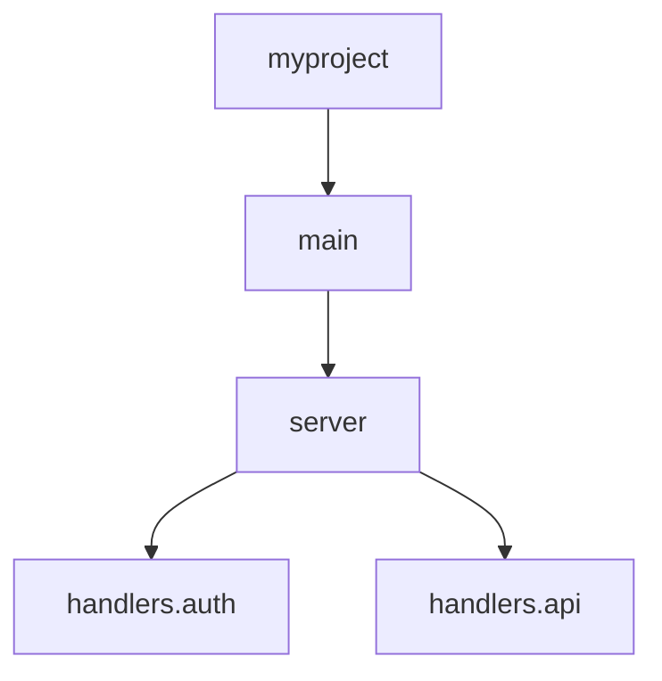

# Import Test MCP Server

A Model Context Protocol (MCP) server that validates Python imports, exports, and dependency correctness in projects. This server helps ensure all imports are valid, finds circular dependencies, detects unused imports, and validates project dependencies.

## Features

### 🔍 Import Analysis
- **File-level analysis**: Analyze imports in individual Python files
- **Project-wide analysis**: Scan entire projects for import issues
- **Import validation**: Check if all imports can be resolved
- **Import classification**: Categorize imports (standard library, third-party, local)

### 🔄 Dependency Management  
- **Circular import detection**: Find circular dependency chains
- **Missing dependency detection**: Identify missing packages
- **Unused import detection**: Find imports that aren't used in the code
- **Dependency validation**: Check project dependencies against installed packages

### 📊 Analysis & Reporting
- **Health scores**: Calculate import health metrics (0-100)
- **Detailed reports**: Get comprehensive analysis results
- **Issue categorization**: Classify issues by type and severity
- **Statistics**: Get project-wide import statistics
- **Dependency tree**: Visualize import relationships as tree diagrams

### 🛠️ Issue Types Detected

- **Missing modules**: Imports that cannot be resolved
- **Missing attributes**: Specific imports from modules that don't exist
- **Circular imports**: Modules that import each other creating cycles
- **Unused imports**: Imported modules/functions that are never used
- **Wildcard imports**: `from module import *` statements
- **Relative import issues**: Problems with relative import paths
- **Import order violations**: Imports not following standard ordering
- **Shadowed imports**: Imports that shadow built-in or other names

## Installation

1. Clone or download this server
2. Install dependencies:
```bash
cd import-test-server
pip install -r requirements.txt
```

## Usage

### With MCP Client (Claude Desktop, VS Code, etc.)

Add to your MCP configuration:

```json
{
  "mcpServers": {
    "import-test": {
      "command": "python",
      "args": ["/path/to/import-test-server/src/main.py"],
      "cwd": "/path/to/your/project"
    }
  }
}
```

### Test Mode (Development)

Run the server in test mode to see a sample analysis:

```bash
cd src
python main.py --test --project-root /path/to/your/python/project
```

## Available Tools

### `import-test-analyze-file`
Analyze imports in a single Python file.

**Parameters:**
- `file_path` (required): Path to Python file
- `check_unused` (optional): Check for unused imports (default: true)
- `check_style` (optional): Check import style (default: true)

**Example:**
```python
# Analyze a specific file
result = await call_tool("import-test-analyze-file", {
    "file_path": "src/main.py"
})
```

### `import-test-analyze-project`
Analyze imports across an entire project.

**Parameters:**
- `project_path` (required): Path to project directory
- `include_test_files` (optional): Include test files (default: true)
- `max_files` (optional): Maximum files to analyze (default: 100)
- `exclude_patterns` (optional): Patterns to exclude

**Example:**
```python
# Analyze entire project
result = await call_tool("import-test-analyze-project", {
    "project_path": ".",
    "max_files": 50
})
```

### `import-test-circular-imports`
Detect circular import dependencies.

**Parameters:**
- `project_path` (required): Path to project directory

**Example:**
```python
# Check for circular imports
result = await call_tool("import-test-circular-imports", {
    "project_path": "."
})
```

### `import-test-validate-dependencies`
Validate project dependencies.

**Parameters:**
- `project_path` (required): Path to project directory
- `check_missing` (optional): Check missing deps (default: true)
- `check_unused` (optional): Check unused deps (default: true)

### `import-test-unused-imports`
Find unused imports in files.

**Parameters:**
- `path` (required): Path to file or directory

### `import-test-get-stats`
Get comprehensive import statistics.

**Parameters:**
- `project_path` (required): Path to project directory

### `import-test-dependency-tree`
Generate a tree structure diagram of import dependencies.

**Parameters:**
- `project_path` (required): Path to project directory
- `format` (optional): Output format - "text", "ascii", "mermaid", "json" (default: "text")
- `max_depth` (optional): Maximum depth of tree (default: 5, max: 10)
- `include_external` (optional): Include external library dependencies (default: false)
- `root_module` (optional): Start tree from specific module

**Example:**
```python
# Generate text dependency tree
result = await call_tool("import-test-dependency-tree", {
    "project_path": ".",
    "format": "text",
    "max_depth": 3,
    "include_external": false
})

# Generate Mermaid diagram for documentation
result = await call_tool("import-test-dependency-tree", {
    "project_path": ".",
    "format": "mermaid",
    "max_depth": 4
})
```

## Example Output

### File Analysis
```
🔍 Import Analysis: main.py
============================================================

📊 Summary:
  Total imports: 15
  Valid imports: 13
  Invalid imports: 2
  Issues found: 4
  Health score: 75.5/100

📦 Imports (15):
  ✅ Line 1: import os [standard_library]
  ✅ Line 2: from pathlib import Path [standard_library]
  ❌ Line 3: import nonexistent_module [unknown]
  ✅ Line 4: from typing import List, Dict [standard_library]

⚠️  Issues (4):
  🔴 Line 3: [missing_module] Cannot resolve import 'nonexistent_module'
     💡 Check if 'nonexistent_module' is installed or spelled correctly
  🟡 Line 10: [unused_import] Unused import 'sys'
     💡 Remove unused import 'sys'
```

### Project Analysis  
```
📁 Project Import Analysis: my-project
============================================================

📊 Overall Statistics:
  Files analyzed: 23
  Total imports: 156
  Valid imports: 142
  Success rate: 91.0%
  Health score: 82.3/100
  Total issues: 18
  Circular imports: 1

📉 Files needing attention:
  🔴 src/models.py: 45.2/100 (8 issues)
  🔴 src/utils.py: 67.1/100 (4 issues)

🔄 Circular Imports (1):
  ⚠️  src.models → src.services → src.models
```

### Dependency Tree Visualization
```
🌳 Dependency Tree
==================================================

└── 📁 myproject
    ├── 📄 main
    │   ├── 📄 server
    │   │   ├── 📄 handlers.auth
    │   │   ├── 📄 handlers.api
    │   │   └── 📄 database.models
    │   ├── 📄 config
    │   └── 📄 utils.helpers
    ├── 📄 tests.test_server
    │   ├── 📄 server
    │   └── 📄 config
    └── 📄 database.models
        ├── 📄 utils.validators
        └── 📦 sqlalchemy  # External dependency
```

### Mermaid Diagram Output


## Configuration

The server respects common Python project structures and configuration files:

- `requirements.txt` - For dependency checking
- `pyproject.toml` - For project metadata (future)
- `.gitignore` - For excluding patterns
- `__init__.py` - For package structure analysis

## Architecture

This server follows clean architecture principles:

- **Domain**: Core models and interfaces (`domain/`)
- **Application**: Use cases and business logic (`application/`)  
- **Infrastructure**: AST parsing, dependency resolution (`infrastructure/`)
- **Presentation**: MCP protocol handling (`mcp_handler.py`)

## Error Handling

The server gracefully handles:

- Missing files or directories
- Syntax errors in Python files
- Import resolution failures
- Package installation issues
- Network connectivity problems (for package checking)

## Performance

- Analysis is performed using Python's AST module for speed
- Large projects are limited by `max_files` parameter
- Caching is used for dependency resolution
- Parallel processing for multiple files (future enhancement)

## Contributing

1. Fork the repository
2. Create a feature branch
3. Add tests for new functionality
4. Ensure all tests pass
5. Submit a pull request

## License

This project is licensed under the MIT License.