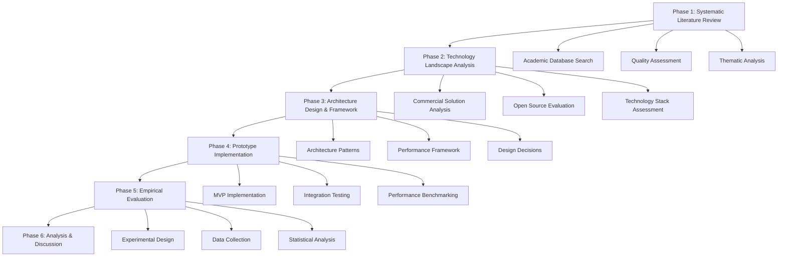

# Forskningsmetodologi og Framework Design

## Overview

Dette design-dokument specificerer den detaljerede forskningsmetodologi og det analytiske framework for kandidatprojektet "Analyse og design af platform til realtids taleoversættelse". Designet etablerer en systematisk tilgang til litteraturstudie, teknologievaluering, arkitekturudvikling og empirisk evaluering, der sikrer videnskabelig rigor og reproducerbarhed.

Forskningsdesignet følger en mixed-methods tilgang der kombinerer systematisk litteraturreview, design science research metodologi, og empirisk performance evaluering for at besvare forskningsspørgsmålene omkring event-drevne mikroservice-arkitekturer til realtidsoversættelse.

## Steering Document Alignment

### Technical Standards (tech.md)
Forskningsmetodologien følger akademiske standarder for:
- **Systematik**: PRISMA guidelines for systematic reviews
- **Reproducerbarhed**: Open Science practices med dokumentation af alle processer
- **Validitet**: Triangulering gennem multiple datakilder og evalueringsmetoder
- **Etik**: Følger SDU's forskningsetiske retningslinjer

### Project Structure (structure.md)
Implementationen vil følge en struktureret tilgang:
- **Phase-baseret**: Klar adskillelse mellem litteraturstudie, design, implementering og evaluering
- **Iterativ**: Agile forskningsmetoder med kontinuerlig validering
- **Dokumenteret**: Alle beslutninger og findings dokumenteres systematisk
- **Reproducerbar**: Alle værktøjer, data og analyser er tilgængelige for verifikation

## Code Reuse Analysis

### Existing Research Methodologies to Leverage
- **Systematic Literature Review Protocol**: ISO/IEC 26515 standards for technical documentation
- **Design Science Research**: Hevner et al. framework for IS research 
- **Technology Acceptance Model**: For evaluering af system usability og adoption
- **Performance Engineering Metodologi**: Benchmarking og load testing practices

### Integration Points
- **Academic Databases**: Integration med SDU bibliotek adgang til IEEE, ACM, Springer
- **Citation Management**: Zotero/Mendeley integration for systematic referencing
- **Data Analysis Tools**: R/Python for statistical analysis og visualisering
- **Version Control**: Git integration for research artifacts og documentation

## Architecture

Forskningsdesignet følger en struktureret, phase-baseret tilgang der sikrer systematik og kvalitet gennem hele forskningsprocessen:

### Modular Design Principles
- **Phase Isolation**: Hver forskningsfase har klare input/output kriterier
- **Method Triangulation**: Multiple evalueringsmetoder for validation
- **Incremental Validation**: Kontinuerlig verification af findings
- **Artifact Traceability**: Klar sammenhæng mellem krav, design og evaluering



## Components and Interfaces

### Systematic Literature Review Component
- **Purpose:** Identificerer og analyserer eksisterende forskning systematisk
- **Interfaces:** 
  - Database search APIs (IEEE, ACM, Google Scholar)
  - Citation management export/import
  - Quality assessment framework
- **Dependencies:** Academic database adgang, citation tools
- **Reuses:** PRISMA checklist, standard quality assessment forms

### Technology Analysis Component  
- **Purpose:** Evaluerer eksisterende teknologier og identificerer gaps
- **Interfaces:**
  - Commercial API documentation analysis
  - Open source code repository analysis
  - Performance benchmarking interfaces
- **Dependencies:** Access til commercial platforms, GitHub APIs
- **Reuses:** Technology evaluation frameworks, comparison matrices

### Architecture Design Component
- **Purpose:** Udvikler reference arkitektur baseret på findings
- **Interfaces:**
  - Architecture decision records (ADR)
  - Design pattern documentation
  - Component interface specifications
- **Dependencies:** Literature findings, technology assessment
- **Reuses:** Software architecture patterns, microservice design principles

### Empirical Evaluation Component
- **Purpose:** Validerer arkitektur gennem prototype og måling
- **Interfaces:**
  - Performance monitoring APIs
  - Load testing framework
  - Quality assessment tools
- **Dependencies:** Prototype implementation, test infrastructure
- **Reuses:** Benchmarking methodologies, statistical analysis frameworks

### Data Analysis Component
- **Purpose:** Analyserer indsamlede data og genererer insights
- **Interfaces:**
  - Statistical analysis tools (R/Python)
  - Visualization libraries
  - Report generation frameworks
- **Dependencies:** Raw data from all components, analysis tools
- **Reuses:** Statistical analysis templates, visualization best practices

## Data Models

### Literature Article Model
```
LiteratureArticle:
- id: unique identifier (DOI/URL)
- title: string
- authors: list of Author objects
- publication_year: integer
- venue: string (journal/conference)
- quality_score: float (0-1)
- relevance_score: float (0-1)
- themes: list of Theme enums
- key_findings: list of strings
- limitations: list of strings
- citation_count: integer
- methodology: string
- contribution_type: enum (theoretical/empirical/design)
```

### Technology Evaluation Model
```
TechnologyEvaluation:
- id: unique identifier
- name: string
- type: enum (commercial/open_source)
- category: enum (ASR/translation/TTS/orchestration)
- version: string
- performance_metrics: PerformanceMetrics object
- licensing: string
- documentation_quality: float (0-1)
- community_support: float (0-1)
- maturity_score: float (0-1)
- integration_complexity: enum (low/medium/high)
- cost_model: string
- strengths: list of strings
- weaknesses: list of strings
```

### Architecture Decision Model
```
ArchitectureDecision:
- id: unique identifier
- decision_name: string
- context: string
- options_considered: list of Option objects
- decision: string
- rationale: string
- consequences: list of strings
- status: enum (proposed/accepted/deprecated)
- date: timestamp
- stakeholders: list of strings
- related_decisions: list of decision_ids
```

### Performance Measurement Model
```
PerformanceMeasurement:
- id: unique identifier
- system_configuration: Configuration object
- test_scenario: string
- measurement_timestamp: timestamp
- metrics: {
  - latency_ms: float
  - throughput_ops_per_sec: float
  - resource_utilization: ResourceMetrics object
  - error_rate: float
  - availability: float
}
- test_duration: integer (seconds)
- load_pattern: string
- environment: Environment object
```

## Error Handling

### Research Quality Scenarios
1. **Insufficient Literature Coverage:**
   - **Handling:** Expand search terms, include more databases, extend time period
   - **Impact:** May require timeline adjustment, affects completeness score

2. **Technology Access Limitations:**
   - **Handling:** Use available free tiers, focus on open source alternatives, request academic access
   - **Impact:** May limit scope of commercial analysis, document as limitation

3. **Implementation Complexity Exceeds Scope:**
   - **Handling:** Reduce prototype complexity, focus on key architectural decisions
   - **Impact:** May affect depth of empirical evaluation, adjust research questions

4. **Performance Data Collection Issues:**
   - **Handling:** Use synthetic benchmarks, focus on relative comparisons
   - **Impact:** May limit absolute performance claims, affects external validity

## Testing Strategy

### Research Method Validation
- **Pilot Study**: Test research instruments on small sample before full study
- **Inter-rater Reliability**: Multiple reviewers for quality assessment
- **Method Triangulation**: Multiple data sources for same research questions

### Literature Review Quality Assurance
- **Search Strategy Validation**: Test search terms on known relevant papers
- **Quality Criteria Validation**: Pilot quality assessment on sample papers
- **Completeness Testing**: Backward/forward citation checking

### Technology Evaluation Validation
- **Benchmark Reproducibility**: Verify performance measurements across multiple runs
- **Configuration Documentation**: Document all test configurations for reproducibility
- **Baseline Validation**: Compare measurements against known benchmarks

## Implementation Timeline

### Phase 1: Literature Review (September - October 2024)
- **Week 1-2**: Define search strategy and quality criteria
- **Week 3-6**: Execute systematic search across databases
- **Week 7-8**: Quality assessment and data extraction
- **Week 9**: Thematic analysis and synthesis

### Phase 2: Technology Analysis (November 2024)
- **Week 1-2**: Commercial platform analysis
- **Week 3-4**: Open source evaluation and testing
- **Week 5**: Technology comparison matrix and recommendations

### Phase 3: Architecture Design (December 2024)
- **Week 1-2**: Design pattern analysis and selection
- **Week 3-4**: Reference architecture development
- **Week 5**: Architecture decision documentation

### Phase 4: Prototype Development (January - March 2025)
- **Month 1**: Core components implementation
- **Month 2**: Integration and system testing
- **Month 3**: Performance optimization and benchmarking

### Phase 5: Empirical Evaluation (April 2025)
- **Week 1-2**: Experimental setup and validation
- **Week 3-4**: Data collection and measurement
- **Week 5**: Analysis and interpretation

### Phase 6: Documentation and Analysis (May 2025)
- **Week 1-2**: Results compilation and statistical analysis
- **Week 3-4**: Discussion, limitations, and future work
- **Week 5**: Final thesis preparation

## Quality Assurance Framework

### Academic Rigor Criteria
- **Systematic Approach**: All phases follow documented procedures
- **Transparency**: All decisions and limitations are documented
- **Reproducibility**: All methods and data are available for verification
- **Validity**: Multiple validation approaches for each research question

### Success Metrics
- **Literature Coverage**: 80%+ of relevant papers identified (validated through citation analysis)
- **Technology Coverage**: 90%+ of relevant technologies evaluated
- **Implementation Completeness**: All critical architecture components implemented
- **Performance Validation**: All performance claims supported by empirical data
- **Academic Standard**: Thesis meets SDU quality requirements for master's level