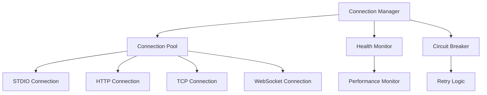

# Connection Manager API Reference

**Module**: `gui.integration.connection_manager`  
**Primary Class**: `ConnectionManager`  
**Interface**: `IConnectionManager`  
**Status**: ✅ Production Ready

## Overview

The Connection Manager handles MCP server connection lifecycle with sophisticated health monitoring, connection pooling, automatic retry with exponential backoff, and comprehensive connection statistics. It implements the Circuit Breaker pattern for resilient connection management and supports multiple connection types.

## Architecture



## Design Patterns

- **Factory Pattern**: Creates appropriate connection types
- **Object Pool Pattern**: Manages connection pooling and reuse
- **Observer Pattern**: Notifies listeners of connection state changes
- **Circuit Breaker Pattern**: Prevents cascade failures with automatic recovery

## Connection Types

### Supported Connection Types

```python
class ConnectionType(Enum):
    STDIO = "stdio"          # Standard input/output (subprocess)
    TCP = "tcp"              # TCP socket communication
    HTTP = "http"            # HTTP REST API communication
    WEBSOCKET = "websocket"  # WebSocket communication
```

### Connection Selection

The connection manager automatically selects the optimal connection type based on:
- Configuration preferences
- Server availability
- Performance characteristics
- Reliability requirements

---

## Configuration

### ConnectionConfig

Complete configuration for connection management.

```python
@dataclass
class ConnectionConfig:
    # Connection type
    connection_type: ConnectionType = ConnectionType.HTTP
    
    # Basic timeouts
    timeout_seconds: float = 30.0
    max_retries: int = 3
    retry_delay_seconds: float = 1.0
    max_retry_delay_seconds: float = 60.0
    keepalive_interval_seconds: float = 30.0
    
    # Connection pooling
    min_connections: int = 3
    max_connections: int = 10
    connection_idle_timeout_seconds: float = 300.0
    
    # Health monitoring
    health_check_interval_seconds: float = 60.0
    health_check_timeout_seconds: float = 5.0
    max_consecutive_failures: int = 5
    
    # HTTP-specific
    http_host: str = "localhost"
    http_port: int = 3000
    http_base_path: str = "/mcp"
    
    # TCP-specific
    tcp_host: str = "localhost"
    tcp_port: int = 4000
    
    # STDIO-specific
    stdio_command: Optional[List[str]] = None
    stdio_working_directory: Optional[Path] = None
    
    # WebSocket-specific
    websocket_url: str = "ws://localhost:8000/mcp"
```

### Configuration Examples

**HTTP Connection (Default)**:
```python
config = ConnectionConfig(
    connection_type=ConnectionType.HTTP,
    http_host="localhost",
    http_port=3000,
    timeout_seconds=30.0,
    max_retries=3
)
```

**STDIO Connection (Python subprocess)**:
```python
config = ConnectionConfig(
    connection_type=ConnectionType.STDIO,
    stdio_command=["python", "mcp-server/main.py"],
    stdio_working_directory=Path("/path/to/server"),
    timeout_seconds=60.0
)
```

**WebSocket Connection**:
```python
config = ConnectionConfig(
    connection_type=ConnectionType.WEBSOCKET,
    websocket_url="ws://localhost:8000/mcp",
    keepalive_interval_seconds=20.0
)
```

**Production Configuration**:
```python
# High-availability production setup
config = ConnectionConfig(
    connection_type=ConnectionType.HTTP,
    min_connections=5,           # Keep 5 warm connections
    max_connections=20,          # Scale up to 20 under load
    timeout_seconds=60.0,        # Longer timeout for large operations
    max_retries=5,              # More retries for reliability
    retry_delay_seconds=2.0,     # Longer initial delay
    max_retry_delay_seconds=120.0,  # Max 2-minute retry delay
    health_check_interval_seconds=30.0,  # More frequent health checks
    max_consecutive_failures=3   # Faster circuit breaking
)
```

---

## Interface Methods

### connect()

Establish connection to MCP server with health monitoring.

```python
async def connect(self) -> bool
```

**Returns**: `bool` - `True` if connection established successfully

**Features**:
- Automatic connection type selection
- Connection pooling for performance
- Health monitoring setup
- Circuit breaker initialization
- Comprehensive error handling

**Example**:
```python
manager = ConnectionManager(config)
success = await manager.connect()
if success:
    print("✅ Connected with health monitoring active")
else:
    print("❌ Connection failed")
```

### disconnect()

Gracefully disconnect from MCP server.

```python
async def disconnect(self) -> None
```

**Features**:
- Graceful connection pool shutdown
- Health monitoring cleanup
- Resource deallocation
- Connection statistics finalization

**Example**:
```python
await manager.disconnect()
print("🔌 Disconnected and cleaned up resources")
```

### is_connected()

Check if currently connected and healthy.

```python
async def is_connected(self) -> bool
```

**Returns**: `bool` - `True` if connected and can handle requests

**Checks**:
- Active connection availability
- Health check status
- Circuit breaker state
- Connection pool health

**Example**:
```python
if await manager.is_connected():
    # Safe to make requests
    response = await make_request()
else:
    # Need to reconnect
    await manager.connect()
```

### get_connection_health()

Get comprehensive connection health information.

```python
async def get_connection_health(self) -> ConnectionHealth
```

**Returns**: `ConnectionHealth` - Detailed health and performance metrics

**ConnectionHealth Structure**:
```python
@dataclass
class ConnectionHealth:
    is_connected: bool
    connection_state: ConnectionState
    last_successful_operation: Optional[datetime]
    last_error: Optional[str]
    round_trip_time_ms: Optional[float]
    server_version: Optional[str]
    active_operations: int
    total_operations: int
    error_count: int
    uptime_seconds: float
    
    @property
    def error_rate(self) -> float:
        """Error rate as percentage (0-100)"""
```

**Example**:
```python
health = await manager.get_connection_health()

print(f"🔗 Connection Status: {health.connection_state.value}")
print(f"⚡ Round Trip Time: {health.round_trip_time_ms:.1f}ms")
print(f"📊 Error Rate: {health.error_rate:.1f}%")
print(f"⏰ Uptime: {health.uptime_seconds:.1f}s")
print(f"🔄 Active Operations: {health.active_operations}")

# Check if performance is degraded
if health.error_rate > 10.0:
    print("⚠️ High error rate detected")
if health.round_trip_time_ms and health.round_trip_time_ms > 1000:
    print("⚠️ High latency detected")
```

### add_connection_listener()

Add callback for connection state changes.

```python
def add_connection_listener(self, callback: ConnectionCallback) -> None
```

**ConnectionCallback Type**:
```python
ConnectionCallback = Callable[[ConnectionState], None]
```

**ConnectionState Values**:
- `DISCONNECTED` - No active connections
- `CONNECTING` - Establishing connection
- `CONNECTED` - Healthy connection available
- `RECONNECTING` - Recovering from failure
- `ERROR` - Connection error occurred
- `DEGRADED` - Connected but with issues

**Example**:
```python
def on_connection_change(state: ConnectionState):
    if state == ConnectionState.CONNECTED:
        print("✅ Connection established")
        # Enable UI operations
        
    elif state == ConnectionState.RECONNECTING:
        print("🔄 Reconnecting to server...")
        # Show reconnection indicator
        
    elif state == ConnectionState.ERROR:
        print("❌ Connection lost")
        # Disable UI operations, show error
        
    elif state == ConnectionState.DEGRADED:
        print("⚠️ Connection degraded")
        # Show performance warning

manager.add_connection_listener(on_connection_change)
```

### remove_connection_listener()

Remove connection state callback.

```python
def remove_connection_listener(self, callback: ConnectionCallback) -> None
```

**Example**:
```python
# Clean up when component is destroyed
manager.remove_connection_listener(on_connection_change)
```

---

## Advanced Features

### Connection Pooling

The connection manager maintains a pool of connections for optimal performance.

#### Pool Configuration
```python
config = ConnectionConfig(
    min_connections=3,        # Always keep 3 warm connections
    max_connections=10,       # Scale up to 10 under load
    connection_idle_timeout_seconds=300.0  # Close idle after 5 minutes
)
```

#### Pool Monitoring
```python
async def monitor_pool():
    health = await manager.get_connection_health()
    pool_stats = health.details.get("connection_pool", {})
    
    print(f"Active connections: {pool_stats.get('active', 0)}")
    print(f"Idle connections: {pool_stats.get('idle', 0)}")
    print(f"Total created: {pool_stats.get('total_created', 0)}")
    print(f"Pool utilization: {pool_stats.get('utilization_percent', 0):.1f}%")
```

### Circuit Breaker Pattern

Automatic failure detection and recovery prevention.

#### Circuit States
- **CLOSED**: Normal operation, requests allowed
- **OPEN**: Failures detected, requests blocked
- **HALF_OPEN**: Testing recovery, limited requests allowed

#### Configuration
```python
config = ConnectionConfig(
    max_consecutive_failures=5,    # Open circuit after 5 failures
    health_check_interval_seconds=60.0,  # Check every minute
    retry_delay_seconds=2.0,       # Start with 2s delay
    max_retry_delay_seconds=120.0  # Max 2-minute delay
)
```

#### Circuit Breaker Monitoring
```python
def on_connection_change(state: ConnectionState):
    if state == ConnectionState.ERROR:
        # Circuit breaker opened
        print("🔴 Circuit breaker opened - blocking requests")
        
    elif state == ConnectionState.RECONNECTING:
        # Circuit breaker half-open
        print("🟡 Circuit breaker testing recovery")
        
    elif state == ConnectionState.CONNECTED:
        # Circuit breaker closed
        print("🟢 Circuit breaker closed - normal operation")
```

### Health Monitoring

Continuous monitoring of connection health and performance.

#### Health Metrics
- **Round-trip time**: Request/response latency
- **Error rate**: Percentage of failed operations
- **Throughput**: Operations per second
- **Availability**: Uptime percentage
- **Connection count**: Active/idle connections

#### Health Monitoring Setup
```python
config = ConnectionConfig(
    health_check_interval_seconds=30.0,  # Check every 30 seconds
    health_check_timeout_seconds=5.0,    # 5-second health check timeout
)

async def monitor_health():
    while True:
        health = await manager.get_connection_health()
        
        # Log health metrics
        logger.info(f"Health check: RTT={health.round_trip_time_ms}ms, "
                   f"ErrorRate={health.error_rate:.1f}%")
        
        # Alert on degraded performance
        if health.connection_state == ConnectionState.DEGRADED:
            alert_manager.send_alert("Connection performance degraded")
        
        await asyncio.sleep(30)  # Check every 30 seconds
```

### Automatic Retry Logic

Exponential backoff with jitter for resilient reconnection.

#### Retry Configuration
```python
config = ConnectionConfig(
    max_retries=5,                    # Try up to 5 times
    retry_delay_seconds=1.0,          # Start with 1 second
    max_retry_delay_seconds=60.0,     # Cap at 60 seconds
)
```

#### Retry Behavior
1. **Initial failure**: Immediate retry
2. **Subsequent failures**: Exponential backoff (1s, 2s, 4s, 8s, 16s...)
3. **Jitter**: Random variation to prevent thundering herd
4. **Max delay**: Capped at configured maximum
5. **Circuit breaker**: Opens after max consecutive failures

#### Custom Retry Logic
```python
class CustomConnectionManager(ConnectionManager):
    async def _calculate_retry_delay(self, attempt: int) -> float:
        """Custom retry delay calculation"""
        base_delay = self.config.retry_delay_seconds
        max_delay = self.config.max_retry_delay_seconds
        
        # Exponential backoff with jitter
        delay = min(base_delay * (2 ** attempt), max_delay)
        jitter = random.uniform(0.1, 0.3) * delay
        
        return delay + jitter
```

---

## Error Handling

### Exception Types

```python
# Connection-specific exceptions inherit from MCPClientError
ConnectionError          # Base connection error
├── ConnectionTimeout    # Connection timeout
├── ConnectionRefused    # Server refused connection
├── ConnectionLost      # Connection dropped during operation
├── AuthenticationError # Authentication failed
└── ProtocolError       # MCP protocol error
```

### Comprehensive Error Handling

```python
async def robust_connection():
    manager = ConnectionManager(config)
    
    try:
        # Attempt connection
        success = await manager.connect()
        if not success:
            raise ConnectionError("Failed to establish connection")
            
        # Verify health
        health = await manager.get_connection_health()
        if not health.is_connected:
            raise ConnectionError("Connection unhealthy after establishment")
            
        return manager
        
    except ConnectionTimeout as e:
        logger.error(f"Connection timed out: {e}")
        # Maybe try alternative connection type
        
    except ConnectionRefused as e:
        logger.error(f"Server refused connection: {e}")
        # Check if server is running
        
    except AuthenticationError as e:
        logger.error(f"Authentication failed: {e}")
        # Check credentials
        
    except Exception as e:
        logger.error(f"Unexpected connection error: {e}")
        # Handle unknown errors
```

### Connection Recovery

```python
async def connection_with_recovery():
    """Connection manager with automatic recovery"""
    
    manager = ConnectionManager(config)
    
    # Set up automatic recovery
    async def on_connection_lost():
        max_recovery_attempts = 10
        
        for attempt in range(max_recovery_attempts):
            logger.info(f"Recovery attempt {attempt + 1}/{max_recovery_attempts}")
            
            try:
                success = await manager.connect()
                if success:
                    logger.info("✅ Connection recovered successfully")
                    return
                    
            except Exception as e:
                logger.error(f"Recovery attempt failed: {e}")
                
            # Exponential backoff
            delay = min(2 ** attempt, 300)  # Max 5 minutes
            await asyncio.sleep(delay)
        
        logger.error("❌ Failed to recover connection after all attempts")
    
    # Register recovery handler
    manager.add_connection_listener(
        lambda state: asyncio.create_task(on_connection_lost())
        if state == ConnectionState.ERROR else None
    )
    
    return manager
```

---

## Performance Optimization

### Connection Tuning

```python
# High-performance configuration
high_perf_config = ConnectionConfig(
    connection_type=ConnectionType.HTTP,
    min_connections=10,          # More warm connections
    max_connections=50,          # Higher scale limit
    connection_idle_timeout_seconds=600.0,  # Keep connections longer
    keepalive_interval_seconds=15.0,        # Frequent keepalives
    timeout_seconds=120.0,       # Generous timeouts
    health_check_interval_seconds=15.0      # Frequent health checks
)
```

### Monitoring and Metrics

```python
async def performance_monitoring():
    """Monitor connection performance metrics"""
    
    performance_monitor = get_performance_monitor()
    
    while True:
        health = await manager.get_connection_health()
        
        # Record performance metrics
        performance_monitor.record_metric("connection_rtt", health.round_trip_time_ms)
        performance_monitor.record_metric("connection_error_rate", health.error_rate)
        performance_monitor.record_metric("active_operations", health.active_operations)
        
        # Connection pool metrics
        pool_stats = health.details.get("connection_pool", {})
        performance_monitor.record_metric("pool_utilization", 
                                        pool_stats.get("utilization_percent", 0))
        
        # Check for performance issues
        if health.round_trip_time_ms and health.round_trip_time_ms > 2000:
            logger.warning(f"High latency detected: {health.round_trip_time_ms}ms")
            
        if health.error_rate > 5.0:
            logger.warning(f"High error rate detected: {health.error_rate:.1f}%")
        
        await asyncio.sleep(60)  # Check every minute
```

### Connection Optimization

```python
class OptimizedConnectionManager(ConnectionManager):
    """Connection manager with advanced optimizations"""
    
    def __init__(self, config: ConnectionConfig):
        super().__init__(config)
        self._connection_cache = {}
        self._performance_history = []
    
    async def get_optimal_connection(self) -> 'Connection':
        """Select optimal connection based on performance history"""
        
        # Analyze performance history
        recent_performance = self._performance_history[-10:]  # Last 10 operations
        
        if not recent_performance:
            return await self._get_any_connection()
        
        # Calculate average performance per connection
        connection_performance = {}
        for record in recent_performance:
            conn_id = record['connection_id']
            latency = record['latency_ms']
            
            if conn_id not in connection_performance:
                connection_performance[conn_id] = []
            connection_performance[conn_id].append(latency)
        
        # Select connection with best average performance
        best_connection_id = min(connection_performance.keys(),
                               key=lambda c: sum(connection_performance[c]) / len(connection_performance[c]))
        
        return self._get_connection_by_id(best_connection_id)
    
    async def _record_operation_performance(self, connection_id: str, latency_ms: float):
        """Record operation performance for optimization"""
        self._performance_history.append({
            'timestamp': datetime.now(),
            'connection_id': connection_id,
            'latency_ms': latency_ms
        })
        
        # Keep only recent history
        if len(self._performance_history) > 100:
            self._performance_history = self._performance_history[-50:]
```

---

## Best Practices

### 1. Configuration Management

```python
# Environment-specific configurations
class ConnectionConfigFactory:
    @staticmethod
    def development() -> ConnectionConfig:
        return ConnectionConfig(
            connection_type=ConnectionType.STDIO,
            stdio_command=["python", "mcp-server/main.py"],
            timeout_seconds=30.0,
            max_retries=1,  # Fast failure for development
            min_connections=1,
            max_connections=3
        )
    
    @staticmethod
    def production() -> ConnectionConfig:
        return ConnectionConfig(
            connection_type=ConnectionType.HTTP,
            http_host=os.getenv("MCP_SERVER_HOST", "localhost"),
            http_port=int(os.getenv("MCP_SERVER_PORT", "3000")),
            timeout_seconds=60.0,
            max_retries=5,
            min_connections=5,
            max_connections=20,
            health_check_interval_seconds=30.0
        )
    
    @staticmethod
    def testing() -> ConnectionConfig:
        return ConnectionConfig(
            connection_type=ConnectionType.HTTP,
            http_host="localhost",
            http_port=3001,  # Test port
            timeout_seconds=10.0,
            max_retries=0,   # No retries in tests
            min_connections=1,
            max_connections=1
        )
```

### 2. Resource Management

```python
# Use context manager for automatic cleanup
async with ConnectionManager(config) as manager:
    # Manager automatically connects and disconnects
    health = await manager.get_connection_health()
    # Resources cleaned up on exit

# Or explicit resource management
manager = ConnectionManager(config)
try:
    await manager.connect()
    # Use manager...
finally:
    await manager.disconnect()
```

### 3. Health Monitoring Integration

```python
class HealthAwareApplication:
    def __init__(self):
        self.connection_manager = ConnectionManager(config)
        self.health_alerts = []
        
        # Set up health monitoring
        self.connection_manager.add_connection_listener(self._on_connection_change)
    
    def _on_connection_change(self, state: ConnectionState):
        if state == ConnectionState.DEGRADED:
            self._handle_degraded_connection()
        elif state == ConnectionState.ERROR:
            self._handle_connection_error()
        elif state == ConnectionState.CONNECTED:
            self._handle_connection_restored()
    
    async def _handle_degraded_connection(self):
        """Handle degraded connection performance"""
        health = await self.connection_manager.get_connection_health()
        
        if health.error_rate > 10.0:
            self.health_alerts.append("High error rate detected")
            # Maybe switch to backup server
            
        if health.round_trip_time_ms and health.round_trip_time_ms > 2000:
            self.health_alerts.append("High latency detected")
            # Maybe adjust UI responsiveness
    
    def _handle_connection_error(self):
        """Handle connection loss"""
        # Disable operations that require server
        self.enable_offline_mode()
        
    def _handle_connection_restored(self):
        """Handle connection restoration"""
        # Re-enable server operations
        self.disable_offline_mode()
        self.health_alerts.clear()
```

---

## See Also

- **[MCP Client](mcp_client.md)** - Main client interface
- **[Tool Invoker](tool_invoker.md)** - Tool execution management
- **[Configuration Guide](../guides/configuration.md)** - Configuration best practices
- **[Error Handling Guide](../guides/error-handling.md)** - Comprehensive error handling
- **[Performance Guide](../guides/performance.md)** - Performance optimization