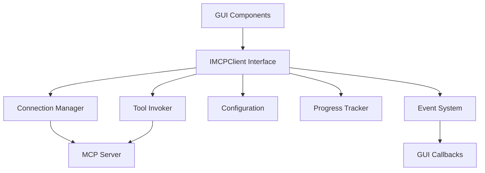

# MCP Client API Reference

**Module**: `gui.integration.mcp_client`  
**Primary Interface**: `IMCPClient`  
**Status**: ✅ Production Ready

## Overview

The MCP Client is the primary interface for all MCP server communication. It provides a comprehensive, type-safe API for document management, tool invocation, and connection handling. The client follows Clean Architecture principles and implements the Facade pattern to provide a unified interface for complex MCP operations.

## Architecture



## Core Interfaces

### IMCPClient

The primary interface that GUI components depend on for all MCP operations.

#### Design Principles
- **Single Entry Point**: Facade pattern for all MCP operations
- **Async-First**: Non-blocking operations for smooth GUI experience
- **Comprehensive Error Handling**: Detailed error context and recovery
- **Progress Tracking**: Real-time updates for long operations
- **Health Monitoring**: Connection health and automatic recovery
- **Type Safety**: Full type validation and IDE support

---

## Connection Management

### connect()

Establish connection to MCP server with health monitoring.

```python
async def connect(self) -> bool
```

**Returns**: `bool` - `True` if connection established successfully

**Example**:
```python
client = MCPClient(config)
success = await client.connect()
if success:
    print("✅ Connected to MCP server")
else:
    print("❌ Connection failed")
```

**Error Handling**:
```python
try:
    await client.connect()
except ConnectionError as e:
    logger.error(f"Connection failed: {e}")
    # Handle connection failure
```

### disconnect()

Gracefully disconnect from MCP server.

```python
async def disconnect(self) -> None
```

**Example**:
```python
await client.disconnect()
print("Disconnected from MCP server")
```

### is_healthy()

Check if client is connected and healthy.

```python
async def is_healthy(self) -> bool
```

**Returns**: `bool` - `True` if client can perform operations

**Example**:
```python
if await client.is_healthy():
    # Client is ready for operations
    result = await client.upload_document(file_path)
else:
    # Client needs reconnection
    await client.connect()
```

### get_health_status()

Get detailed health and performance information.

```python
async def get_health_status(self) -> ConnectionHealth
```

**Returns**: `ConnectionHealth` - Comprehensive health status

**ConnectionHealth Structure**:
```python
@dataclass
class ConnectionHealth:
    is_connected: bool
    connection_state: ConnectionState
    last_successful_operation: Optional[datetime]
    last_error: Optional[str]
    round_trip_time_ms: Optional[float]
    server_version: Optional[str]
    active_operations: int
    total_operations: int
    error_count: int
    uptime_seconds: float
    
    @property
    def error_rate(self) -> float:
        """Error rate as percentage"""
```

**Example**:
```python
health = await client.get_health_status()
print(f"Connection: {health.is_connected}")
print(f"Uptime: {health.uptime_seconds}s")
print(f"Error Rate: {health.error_rate:.1f}%")
print(f"Round Trip: {health.round_trip_time_ms}ms")
```

---

## Event Management

### add_connection_listener()

Add callback for connection state changes.

```python
def add_connection_listener(self, callback: ConnectionCallback) -> None
```

**Parameters**:
- `callback`: `ConnectionCallback` - Function called on state changes

**ConnectionCallback Type**:
```python
ConnectionCallback = Callable[[ConnectionState], None]
```

**ConnectionState Values**:
- `DISCONNECTED` - Not connected
- `CONNECTING` - Establishing connection  
- `CONNECTED` - Successfully connected
- `RECONNECTING` - Attempting reconnection
- `ERROR` - Connection error
- `DEGRADED` - Connected with issues

**Example**:
```python
def on_connection_change(state: ConnectionState):
    if state == ConnectionState.CONNECTED:
        print("✅ Connected to server")
    elif state == ConnectionState.ERROR:
        print("❌ Connection error")
    elif state == ConnectionState.RECONNECTING:
        print("🔄 Reconnecting...")

client.add_connection_listener(on_connection_change)
```

### remove_connection_listener()

Remove connection state callback.

```python
def remove_connection_listener(self, callback: ConnectionCallback) -> None
```

**Example**:
```python
# Clean up when done
client.remove_connection_listener(on_connection_change)
```

### add_error_listener()

Add callback for error events.

```python
def add_error_listener(self, callback: ErrorCallback) -> None
```

**ErrorCallback Type**:
```python
ErrorCallback = Callable[[Exception, Dict[str, Any]], None]
```

**Example**:
```python
def on_error(error: Exception, context: Dict[str, Any]):
    print(f"Error: {error}")
    print(f"Context: {context}")
    
    # Log error details
    logger.error(f"MCP Error: {error}", extra=context)

client.add_error_listener(on_error)
```

---

## Document Management

### upload_document()

Upload and parse a document file with progress tracking.

```python
async def upload_document(
    self,
    file_path: str,
    title: Optional[str] = None,
    tags: Optional[List[str]] = None,
    progress_callback: Optional[ProgressCallback] = None,
) -> MCPResponse
```

**Parameters**:
- `file_path`: `str` - Path to document file
- `title`: `Optional[str]` - Document title override  
- `tags`: `Optional[List[str]]` - Tags for categorization
- `progress_callback`: `Optional[ProgressCallback]` - Progress tracking

**Returns**: `MCPResponse` - Upload result with document_id

**MCPResponse Structure**:
```python
@dataclass
class MCPResponse:
    success: bool
    operation_id: str
    operation_name: str
    data: Optional[Any] = None
    error_message: Optional[str] = None
    error_code: Optional[str] = None
    error_details: Optional[Dict[str, Any]] = None
    execution_time_ms: float = 0.0
    timestamp: Optional[datetime] = None
    server_version: Optional[str] = None
```

**Example**:
```python
# Basic upload
result = await client.upload_document("/path/to/document.pdf")
if result.success:
    doc_id = result.data["document_id"]
    print(f"✅ Document uploaded: ID {doc_id}")
else:
    print(f"❌ Upload failed: {result.error_message}")
```

**With progress tracking**:
```python
def progress_handler(progress: OperationProgress):
    print(f"📊 {progress.phase.name}: {progress.progress_percent:.1f}%")
    print(f"   {progress.current_step}")

result = await client.upload_document(
    file_path="/path/to/large_document.pdf",
    title="Large Document",
    tags=["research", "important"],
    progress_callback=progress_handler
)
```

**Error handling**:
```python
try:
    result = await client.upload_document(file_path)
    if result.success:
        # Handle success
        doc_id = result.data["document_id"]
    else:
        # Handle tool error
        print(f"Upload failed: {result.error_message}")
        
except ConnectionError:
    # Handle connection issues
    await client.connect()
    
except ValidationError as e:
    # Handle invalid file path or parameters
    print(f"Invalid parameters: {e}")
    
except TimeoutError:
    # Handle timeout
    print("Upload timed out")
```

### get_document()

Retrieve document metadata by ID.

```python
async def get_document(self, document_id: int) -> MCPResponse
```

**Parameters**:
- `document_id`: `int` - Unique document identifier

**Returns**: `MCPResponse` - Document information

**Example**:
```python
result = await client.get_document(42)
if result.success:
    doc = result.data
    print(f"Title: {doc['title']}")
    print(f"Type: {doc['file_type']}")
    print(f"Pages: {doc['total_pages']}")
    print(f"Words: {doc['total_words']}")
    print(f"Indexed: {'✅' if doc['indexed'] else '❌'}")
else:
    print(f"Document not found: {result.error_message}")
```

### list_documents()

List documents with optional filtering and pagination.

```python
async def list_documents(
    self,
    filters: Optional[Dict[str, Any]] = None,
    limit: int = 20,
    offset: int = 0
) -> MCPResponse
```

**Parameters**:
- `filters`: `Optional[Dict[str, Any]]` - Filter criteria
- `limit`: `int` - Maximum documents to return (default: 20)
- `offset`: `int` - Documents to skip for pagination (default: 0)

**Filter Options**:
- `file_type`: Filter by file type ("pdf", "docx", "md", "pptx")
- `tags`: Filter by tags (list of strings)
- `indexed`: Filter by indexing status (boolean)
- `date_from`: Filter by upload date (ISO string)
- `date_to`: Filter by upload date (ISO string)

**Returns**: `MCPResponse` - List of documents and total count

**Example**:
```python
# List all documents
result = await client.list_documents()
if result.success:
    docs = result.data["documents"]
    total = result.data["total"]
    print(f"Found {total} documents:")
    for doc in docs:
        print(f"  • {doc['title']} ({doc['file_type']})")
```

**With filtering**:
```python
# Filter PDF documents that are indexed
filters = {
    "file_type": "pdf",
    "indexed": True,
    "tags": ["research"]
}

result = await client.list_documents(
    filters=filters,
    limit=10,
    offset=0
)

if result.success:
    docs = result.data["documents"]
    print(f"Found {len(docs)} filtered documents")
```

**Pagination**:
```python
# Get second page of results
result = await client.list_documents(
    limit=20,
    offset=20  # Skip first 20 documents
)
```

### search_documents()

Search documents using full-text search.

```python
async def search_documents(
    self,
    query: str,
    filters: Optional[Dict[str, Any]] = None,
    limit: int = 20
) -> MCPResponse
```

**Parameters**:
- `query`: `str` - Search query string
- `filters`: `Optional[Dict[str, Any]]` - Additional filters
- `limit`: `int` - Maximum results (default: 20)

**Returns**: `MCPResponse` - Search results with relevance scores

**Example**:
```python
# Search for documents about Angular
result = await client.search_documents("angular framework")
if result.success:
    results = result.data["results"]
    total = result.data["total_results"]
    
    print(f"Found {total} matching documents:")
    for item in results:
        print(f"  • {item['title']} (Score: {item['relevance_score']:.2f})")
        print(f"    {item['match_excerpt']}")
```

**With filters**:
```python
# Search only in PDF documents
result = await client.search_documents(
    query="machine learning",
    filters={"file_type": "pdf"},
    limit=10
)
```

### delete_document()

Delete document and all related data.

```python
async def delete_document(self, document_id: int) -> MCPResponse
```

**Parameters**:
- `document_id`: `int` - Document to delete

**Returns**: `MCPResponse` - Deletion confirmation

**Note**: This cascades to delete chunks and summaries

**Example**:
```python
result = await client.delete_document(42)
if result.success:
    print("✅ Document deleted successfully")
else:
    print(f"❌ Delete failed: {result.error_message}")
```

---

## Document Structure

### index_document()

Create searchable chunks from document content.

```python
async def index_document(
    self,
    document_id: int,
    strategy: str = "auto",
    progress_callback: Optional[ProgressCallback] = None,
) -> MCPResponse
```

**Parameters**:
- `document_id`: `int` - Document to index
- `strategy`: `str` - Chunking strategy (default: "auto")
- `progress_callback`: `Optional[ProgressCallback]` - Progress tracking

**Chunking Strategies**:
- `"auto"`: Automatically detect best strategy
- `"chapter"`: Split by chapters (for books)
- `"section"`: Split by sections (for papers)
- `"heading"`: Split by headings (for markdown/docx)
- `"slide"`: Split by slides (for presentations)
- `"fixed"`: Fixed-length chunks (fallback)

**Returns**: `MCPResponse` - Indexing results and chunk count

**Example**:
```python
# Index with automatic strategy detection
result = await client.index_document(42)
if result.success:
    chunks = result.data["chunks_created"]
    print(f"✅ Created {chunks} chunks")
```

**With specific strategy**:
```python
def progress_handler(progress: OperationProgress):
    print(f"Indexing: {progress.progress_percent:.1f}% - {progress.current_step}")

result = await client.index_document(
    document_id=42,
    strategy="chapter",  # Use chapter detection
    progress_callback=progress_handler
)

if result.success:
    chunks_data = result.data["chunks"]
    print(f"Created {len(chunks_data)} chapters:")
    for chunk in chunks_data:
        print(f"  • {chunk['title']} ({chunk['word_count']} words)")
```

### get_document_structure()

Get document outline/structure (list of chunks/chapters).

```python
async def get_document_structure(self, document_id: int) -> MCPResponse
```

**Parameters**:
- `document_id`: `int` - Document to get structure for

**Returns**: `MCPResponse` - Document structure information

**Example**:
```python
result = await client.get_document_structure(42)
if result.success:
    doc_info = result.data
    print(f"Document: {doc_info['document_title']}")
    print(f"Indexed: {'✅' if doc_info['indexed'] else '❌'}")
    
    if doc_info['indexed']:
        chunks = doc_info['chunks']
        print(f"Structure ({len(chunks)} chunks):")
        for chunk in chunks:
            print(f"  {chunk['chunk_index']}. {chunk['title']}")
            print(f"     Type: {chunk['chunk_type']}, Words: {chunk['word_count']}")
```

### get_chunk_content()

Retrieve full text content of specific chunk.

```python
async def get_chunk_content(self, chunk_id: int) -> MCPResponse
```

**Parameters**:
- `chunk_id`: `int` - Chunk to retrieve

**Returns**: `MCPResponse` - Chunk text content

**Example**:
```python
result = await client.get_chunk_content(102)
if result.success:
    chunk = result.data
    print(f"Chunk: {chunk['title']}")
    print(f"Words: {chunk['word_count']}")
    print(f"Content: {chunk['content'][:200]}...")  # First 200 chars
    
    # Full content available for AI processing
    full_content = chunk['content']
```

---

## Summary Management

### get_summary()

Retrieve existing summary for chunk or document.

```python
async def get_summary(
    self,
    chunk_id: Optional[int] = None,
    document_id: Optional[int] = None,
    summary_type: str = "standard",
) -> MCPResponse
```

**Parameters**:
- `chunk_id`: `Optional[int]` - Specific chunk to get summary for
- `document_id`: `Optional[int]` - Document to get summary for  
- `summary_type`: `str` - Summary type (default: "standard")

**Summary Types**:
- `"brief"`: 100-150 words
- `"standard"`: 250-350 words  
- `"detailed"`: 500-750 words

**Returns**: `MCPResponse` - Summary content

**Example**:
```python
# Get chunk summary
result = await client.get_summary(chunk_id=102)
if result.success:
    summary = result.data
    print(f"Summary Type: {summary['summary_type']}")
    print(f"Generated by: {summary['model_name']}")
    print(f"Content:\n{summary['summary_content']}")
else:
    print("No summary available")
```

**Get document-level summary**:
```python
result = await client.get_summary(
    document_id=42,
    summary_type="brief"
)
```

### save_summary()

Save AI-generated summary.

```python
async def save_summary(
    self,
    summary_content: str,
    summary_type: str = "standard",
    chunk_id: Optional[int] = None,
    document_id: Optional[int] = None,
    model_name: Optional[str] = None,
) -> MCPResponse
```

**Parameters**:
- `summary_content`: `str` - Summary text in markdown format
- `summary_type`: `str` - Summary type (default: "standard")
- `chunk_id`: `Optional[int]` - Chunk this applies to
- `document_id`: `Optional[int]` - Document this applies to
- `model_name`: `Optional[str]` - AI model name

**Returns**: `MCPResponse` - Save confirmation with summary_id

**Example**:
```python
# AI agent workflow
summary_text = """
# Chapter 2: Core Concepts - Summary

This chapter introduces the fundamental concepts of Angular framework...

## Key Points
- Component-based architecture
- Dependency injection
- TypeScript integration

## Code Examples
The chapter demonstrates creating components...
"""

result = await client.save_summary(
    summary_content=summary_text,
    summary_type="standard",
    chunk_id=102,
    model_name="gpt-4"
)

if result.success:
    summary_id = result.data["summary_id"]
    print(f"✅ Summary saved with ID: {summary_id}")
```

### list_summaries()

List available summaries for document or chunk.

```python
async def list_summaries(
    self,
    document_id: Optional[int] = None,
    chunk_id: Optional[int] = None
) -> MCPResponse
```

**Parameters**:
- `document_id`: `Optional[int]` - Document to list summaries for
- `chunk_id`: `Optional[int]` - Chunk to list summaries for

**Returns**: `MCPResponse` - List of available summaries

**Example**:
```python
# List all summaries for a document
result = await client.list_summaries(document_id=42)
if result.success:
    summaries = result.data["summaries"]
    print(f"Available summaries ({len(summaries)}):")
    for summary in summaries:
        print(f"  • {summary['summary_type']} - Chunk {summary['chunk_id']}")
        print(f"    Generated: {summary['created_date']}")
        print(f"    Model: {summary['model_name']}")
```

---

## Progress Tracking

### OperationProgress

Progress information for long-running operations.

```python
@dataclass
class OperationProgress:
    operation_id: str
    operation_name: str
    phase: ProgressPhase
    progress_percent: float  # 0.0 to 100.0
    current_step: str
    total_steps: Optional[int] = None
    elapsed_time_ms: float = 0.0
    estimated_remaining_ms: Optional[float] = None
    details: Optional[Dict[str, Any]] = None
```

### ProgressPhase

Phases of operation progress.

```python
class ProgressPhase(Enum):
    VALIDATING = auto()     # Validating input parameters
    CONNECTING = auto()     # Establishing server connection  
    TRANSMITTING = auto()   # Sending request to server
    PROCESSING = auto()     # Server processing request
    RECEIVING = auto()      # Receiving response from server
    FINALIZING = auto()     # Processing and validating response
```

### Progress Callback

Type for progress callbacks.

```python
ProgressCallback = Callable[[OperationProgress], None]
```

**Example Progress Handler**:
```python
def detailed_progress_handler(progress: OperationProgress):
    """Comprehensive progress display"""
    
    # Show progress bar
    bar_width = 20
    filled = int((progress.progress_percent / 100) * bar_width)
    bar = "█" * filled + "░" * (bar_width - filled)
    
    print(f"\r{progress.operation_name}")
    print(f"  [{bar}] {progress.progress_percent:.1f}%")
    print(f"  Phase: {progress.phase.name}")
    print(f"  Step: {progress.current_step}")
    
    if progress.estimated_remaining_ms:
        remaining_sec = progress.estimated_remaining_ms / 1000
        print(f"  ETA: {remaining_sec:.1f}s")
    
    # Show details if available
    if progress.details:
        for key, value in progress.details.items():
            print(f"  {key}: {value}")
```

---

## Error Handling

### Exception Hierarchy

```python
MCPClientError
├── ConnectionError      # Server connection issues
├── ValidationError      # Parameter validation failures
├── TimeoutError        # Operation timeout
├── ToolNotFoundError   # Unknown MCP tool
└── ServerError         # MCP server-side errors
```

### Exception Details

All exceptions include comprehensive context:

```python
class MCPClientError(Exception):
    def __init__(
        self,
        message: str,
        error_code: Optional[str] = None,
        operation_id: Optional[str] = None,
        original_error: Optional[Exception] = None,
    ):
        self.error_code = error_code
        self.operation_id = operation_id
        self.original_error = original_error
```

### Comprehensive Error Handling

```python
async def robust_operation():
    try:
        result = await client.upload_document("/path/to/doc.pdf")
        if result.success:
            return result.data["document_id"]
        else:
            # Handle tool-level errors
            logger.error(f"Tool failed: {result.error_message}")
            return None
            
    except ConnectionError as e:
        # Handle connection issues
        logger.error(f"Connection failed: {e}")
        
        # Attempt reconnection
        try:
            await client.connect()
            # Retry operation
            return await client.upload_document("/path/to/doc.pdf")
        except Exception:
            logger.error("Reconnection failed")
            return None
            
    except ValidationError as e:
        # Handle parameter validation
        logger.error(f"Invalid parameters: {e}")
        return None
        
    except TimeoutError as e:
        # Handle timeout
        logger.error(f"Operation timed out: {e}")
        return None
        
    except ToolNotFoundError as e:
        # Handle unknown tool
        logger.error(f"Tool not found: {e}")
        return None
        
    except ServerError as e:
        # Handle server-side errors
        logger.error(f"Server error: {e}")
        return None
        
    except Exception as e:
        # Handle unexpected errors
        logger.error(f"Unexpected error: {e}")
        return None
```

---

## Best Practices

### 1. Connection Management

```python
# Use context manager for automatic cleanup
async with MCPClient(config) as client:
    result = await client.upload_document(file_path)
    # Client automatically disconnected

# Or manual management
client = MCPClient(config)
try:
    await client.connect()
    # Use client...
finally:
    await client.disconnect()
```

### 2. Error Recovery

```python
async def resilient_client():
    """Client with automatic error recovery"""
    
    client = MCPClient(config)
    
    async def with_retry(operation, max_retries=3):
        for attempt in range(max_retries):
            try:
                if not await client.is_healthy():
                    await client.connect()
                
                return await operation()
                
            except ConnectionError:
                if attempt < max_retries - 1:
                    await asyncio.sleep(2 ** attempt)  # Exponential backoff
                else:
                    raise
    
    return with_retry
```

### 3. Progress Tracking

```python
class ProgressTracker:
    def __init__(self):
        self.operations = {}
    
    def track_operation(self, operation_name: str):
        def progress_handler(progress: OperationProgress):
            self.operations[progress.operation_id] = progress
            self.update_ui(progress)
        
        return progress_handler
    
    def update_ui(self, progress: OperationProgress):
        # Update progress bar, status text, etc.
        pass

# Usage
tracker = ProgressTracker()
result = await client.upload_document(
    file_path,
    progress_callback=tracker.track_operation("Upload Document")
)
```

### 4. Configuration

```python
# Production configuration
config = ConfigManager({
    "server_path": "mcp-server/main.py",
    "timeout": 60,           # Longer timeout for large files
    "retry_attempts": 5,     # More retries for reliability
    "log_level": "INFO",     # Appropriate logging level
    "max_concurrent": 3,     # Limit concurrent operations
})

# Development configuration
dev_config = ConfigManager({
    "server_path": "mcp-server/main.py", 
    "timeout": 30,
    "retry_attempts": 1,     # Fast failure for debugging
    "log_level": "DEBUG",    # Detailed logging
    "mock_mode": True,       # Use mock client
})
```

---

## See Also

- **[Async MCP Client](async_mcp_client.md)** - Asynchronous implementation details
- **[Connection Manager](connection_manager.md)** - Connection lifecycle management  
- **[Tool Invoker](tool_invoker.md)** - Tool execution and validation
- **[Configuration Guide](../guides/configuration.md)** - Configuration best practices
- **[Error Handling Guide](../guides/error-handling.md)** - Comprehensive error handling
- **[Testing Guide](../guides/testing-integration.md)** - Testing MCP integrations