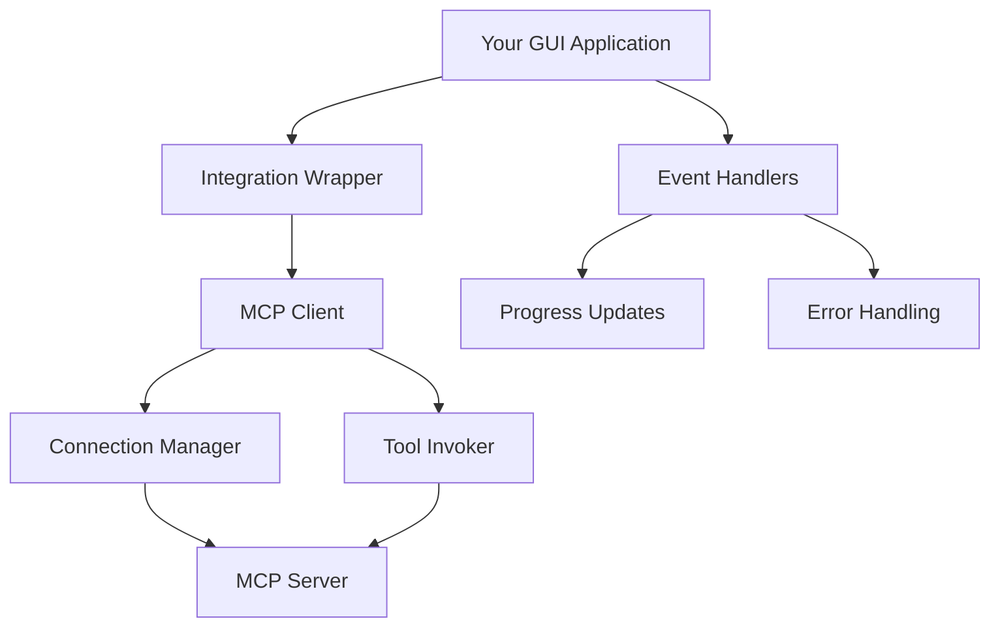

# Basic Integration Guide

**Learn how to integrate the Study Buddy MCP layer into your GUI application.**

## 🎯 Overview

This guide walks you through the complete process of integrating the MCP layer into a GUI application. You'll learn how to establish connections, invoke tools, handle responses, and implement robust error handling.

## 📋 Prerequisites

- Python 3.8+
- Study Buddy MCP Server
- Basic understanding of async/await
- Familiarity with GUI event handling

## 🏗️ Integration Architecture



## 🚀 Step-by-Step Integration

### Step 1: Set Up Dependencies

First, ensure you have the integration layer available:

```python
# Add to your GUI application imports
import asyncio
from gui.integration import (
    MCPClient,
    ConfigManager, 
    ConnectionManager,
    MCPConnectionError,
    MCPResponse,
    ConnectionState,
    OperationProgress
)
```

### Step 2: Create Configuration

Set up configuration for your environment:

```python
def create_mcp_config():
    """Create MCP configuration for your application"""
    
    # Development configuration
    if os.getenv("ENV") == "development":
        return ConfigManager({
            "connection_type": "stdio",
            "server_command": ["python", "mcp-server/main.py"],
            "server_working_dir": "mcp-server/",
            "timeout": 30,
            "retry_attempts": 1,  # Fast failure for development
            "log_level": "DEBUG"
        })
    
    # Production configuration
    return ConfigManager({
        "connection_type": "http",
        "server_host": "localhost",
        "server_port": 3000,
        "timeout": 60,
        "retry_attempts": 5,
        "log_level": "INFO",
        "min_connections": 3,
        "max_connections": 10
    })
```

### Step 3: Create Integration Wrapper

Create a wrapper class that manages MCP integration for your GUI:

```python
class MCPIntegrationManager:
    """
    Manages MCP integration for GUI applications.
    
    Provides high-level interface for document operations
    with proper error handling and event management.
    """
    
    def __init__(self, config: ConfigManager):
        self.config = config
        self.client = None
        self._connection_listeners = []
        self._progress_listeners = []
        self._error_listeners = []
        self._is_initialized = False
        
    async def initialize(self) -> bool:
        """Initialize MCP client and establish connection"""
        try:
            # Create client
            self.client = MCPClient(self.config)
            
            # Set up event handlers
            self.client.add_connection_listener(self._on_connection_change)
            self.client.add_error_listener(self._on_error)
            
            # Connect to server
            success = await self.client.connect()
            if success:
                self._is_initialized = True
                print("✅ MCP integration initialized successfully")
            else:
                print("❌ Failed to initialize MCP integration")
            
            return success
            
        except Exception as e:
            print(f"❌ MCP initialization error: {e}")
            return False
    
    async def shutdown(self):
        """Gracefully shutdown MCP integration"""
        if self.client:
            await self.client.disconnect()
            print("🔌 MCP integration shutdown complete")
    
    def is_ready(self) -> bool:
        """Check if MCP integration is ready for operations"""
        return self._is_initialized and self.client is not None
    
    # Event handler registration
    def add_connection_listener(self, callback):
        """Add callback for connection state changes"""
        self._connection_listeners.append(callback)
    
    def add_progress_listener(self, callback):
        """Add callback for operation progress updates"""
        self._progress_listeners.append(callback)
    
    def add_error_listener(self, callback):
        """Add callback for error events"""
        self._error_listeners.append(callback)
    
    # Internal event handlers
    def _on_connection_change(self, state: ConnectionState):
        """Handle connection state changes"""
        for callback in self._connection_listeners:
            try:
                callback(state)
            except Exception as e:
                print(f"Connection listener error: {e}")
    
    def _on_error(self, error: Exception, context: dict):
        """Handle MCP errors"""
        for callback in self._error_listeners:
            try:
                callback(error, context)
            except Exception as e:
                print(f"Error listener error: {e}")
    
    def _create_progress_callback(self, operation_name: str):
        """Create progress callback for operations"""
        def progress_callback(progress: OperationProgress):
            for callback in self._progress_listeners:
                try:
                    callback(operation_name, progress)
                except Exception as e:
                    print(f"Progress listener error: {e}")
        return progress_callback
    
    # High-level document operations
    async def upload_document(self, file_path: str, title: str = None, tags: list = None) -> dict:
        """Upload document with GUI-friendly response"""
        if not self.is_ready():
            return {"success": False, "error": "MCP not initialized"}
        
        try:
            progress_callback = self._create_progress_callback("Upload Document")
            
            response = await self.client.upload_document(
                file_path=file_path,
                title=title,
                tags=tags or [],
                progress_callback=progress_callback
            )
            
            return {
                "success": response.success,
                "document_id": response.data.get("document_id") if response.success else None,
                "title": response.data.get("title") if response.success else None,
                "error": response.error_message if not response.success else None,
                "execution_time": response.execution_time_ms
            }
            
        except Exception as e:
            return {"success": False, "error": str(e)}
    
    async def get_documents(self, filters: dict = None) -> dict:
        """Get document list with GUI-friendly response"""
        if not self.is_ready():
            return {"success": False, "error": "MCP not initialized"}
        
        try:
            response = await self.client.list_documents(filters=filters or {})
            
            return {
                "success": response.success,
                "documents": response.data.get("documents", []) if response.success else [],
                "total": response.data.get("total", 0) if response.success else 0,
                "error": response.error_message if not response.success else None
            }
            
        except Exception as e:
            return {"success": False, "error": str(e)}
    
    async def search_documents(self, query: str, filters: dict = None) -> dict:
        """Search documents with GUI-friendly response"""
        if not self.is_ready():
            return {"success": False, "error": "MCP not initialized"}
        
        try:
            response = await self.client.search_documents(
                query=query, 
                filters=filters or {}
            )
            
            return {
                "success": response.success,
                "results": response.data.get("results", []) if response.success else [],
                "total": response.data.get("total_results", 0) if response.success else 0,
                "error": response.error_message if not response.success else None
            }
            
        except Exception as e:
            return {"success": False, "error": str(e)}
    
    async def delete_document(self, document_id: int) -> dict:
        """Delete document with GUI-friendly response"""
        if not self.is_ready():
            return {"success": False, "error": "MCP not initialized"}
        
        try:
            response = await self.client.delete_document(document_id)
            
            return {
                "success": response.success,
                "error": response.error_message if not response.success else None
            }
            
        except Exception as e:
            return {"success": False, "error": str(e)}
    
    async def get_connection_health(self) -> dict:
        """Get connection health with GUI-friendly response"""
        if not self.client:
            return {"healthy": False, "error": "Client not initialized"}
        
        try:
            health = await self.client.get_health_status()
            
            return {
                "healthy": health.is_connected,
                "state": health.connection_state.value,
                "uptime": health.uptime_seconds,
                "error_rate": health.error_rate,
                "round_trip_time": health.round_trip_time_ms,
                "active_operations": health.active_operations
            }
            
        except Exception as e:
            return {"healthy": False, "error": str(e)}
```

### Step 4: GUI Integration Example

Here's how to integrate with different GUI frameworks:

#### Tkinter Integration

```python
import tkinter as tk
from tkinter import ttk, messagebox, filedialog
import asyncio
import threading

class StudyBuddyGUI:
    def __init__(self):
        self.root = tk.Tk()
        self.root.title("Study Buddy")
        self.mcp_manager = None
        self.setup_ui()
        self.setup_mcp()
    
    def setup_ui(self):
        """Set up the GUI interface"""
        # Main frame
        main_frame = ttk.Frame(self.root, padding="10")
        main_frame.grid(row=0, column=0, sticky=(tk.W, tk.E, tk.N, tk.S))
        
        # Connection status
        self.status_label = ttk.Label(main_frame, text="Disconnected")
        self.status_label.grid(row=0, column=0, columnspan=2, pady=(0, 10))
        
        # Upload button
        self.upload_btn = ttk.Button(
            main_frame, 
            text="Upload Document", 
            command=self.upload_document,
            state="disabled"
        )
        self.upload_btn.grid(row=1, column=0, padx=(0, 5))
        
        # Documents list
        self.docs_tree = ttk.Treeview(
            main_frame, 
            columns=("Title", "Type", "Pages"), 
            show="headings",
            height=10
        )
        self.docs_tree.heading("Title", text="Title")
        self.docs_tree.heading("Type", text="Type")
        self.docs_tree.heading("Pages", text="Pages")
        self.docs_tree.grid(row=2, column=0, columnspan=2, pady=(10, 0))
        
        # Progress bar
        self.progress_var = tk.StringVar()
        self.progress_label = ttk.Label(main_frame, textvariable=self.progress_var)
        self.progress_label.grid(row=3, column=0, columnspan=2, pady=(5, 0))
        
        self.progress_bar = ttk.Progressbar(main_frame, mode="determinate")
        self.progress_bar.grid(row=4, column=0, columnspan=2, sticky=(tk.W, tk.E), pady=(5, 0))
    
    def setup_mcp(self):
        """Set up MCP integration"""
        # Run MCP initialization in background thread
        threading.Thread(target=self.initialize_mcp, daemon=True).start()
    
    def initialize_mcp(self):
        """Initialize MCP integration (runs in background thread)"""
        async def init_async():
            config = create_mcp_config()
            self.mcp_manager = MCPIntegrationManager(config)
            
            # Set up event handlers
            self.mcp_manager.add_connection_listener(self.on_connection_change)
            self.mcp_manager.add_progress_listener(self.on_progress_update)
            self.mcp_manager.add_error_listener(self.on_mcp_error)
            
            # Initialize
            success = await self.mcp_manager.initialize()
            
            # Update UI on main thread
            self.root.after(0, self.on_mcp_initialized, success)
            
            if success:
                # Load initial documents
                await self.refresh_documents()
        
        # Run async initialization
        loop = asyncio.new_event_loop()
        asyncio.set_event_loop(loop)
        loop.run_until_complete(init_async())
    
    def on_mcp_initialized(self, success: bool):
        """Handle MCP initialization completion (main thread)"""
        if success:
            self.status_label.config(text="Connected ✅", foreground="green")
            self.upload_btn.config(state="normal")
        else:
            self.status_label.config(text="Connection Failed ❌", foreground="red")
            messagebox.showerror("Error", "Failed to connect to MCP server")
    
    def on_connection_change(self, state: ConnectionState):
        """Handle connection state changes"""
        def update_ui():
            if state == ConnectionState.CONNECTED:
                self.status_label.config(text="Connected ✅", foreground="green")
                self.upload_btn.config(state="normal")
            elif state == ConnectionState.CONNECTING:
                self.status_label.config(text="Connecting... 🔄", foreground="blue")
                self.upload_btn.config(state="disabled")
            elif state == ConnectionState.ERROR:
                self.status_label.config(text="Disconnected ❌", foreground="red")
                self.upload_btn.config(state="disabled")
        
        self.root.after(0, update_ui)
    
    def on_progress_update(self, operation_name: str, progress: OperationProgress):
        """Handle progress updates"""
        def update_progress():
            self.progress_var.set(f"{operation_name}: {progress.current_step}")
            self.progress_bar["value"] = progress.progress_percent
        
        self.root.after(0, update_progress)
    
    def on_mcp_error(self, error: Exception, context: dict):
        """Handle MCP errors"""
        def show_error():
            messagebox.showerror("MCP Error", f"Error: {error}\\n\\nContext: {context}")
        
        self.root.after(0, show_error)
    
    def upload_document(self):
        """Handle upload button click"""
        file_path = filedialog.askopenfilename(
            title="Select Document",
            filetypes=[
                ("PDF files", "*.pdf"),
                ("Word documents", "*.docx"),
                ("Markdown files", "*.md"),
                ("PowerPoint files", "*.pptx"),
                ("All files", "*.*")
            ]
        )
        
        if file_path:
            # Run upload in background
            threading.Thread(
                target=self.upload_document_async, 
                args=(file_path,), 
                daemon=True
            ).start()
    
    def upload_document_async(self, file_path: str):
        """Upload document asynchronously"""
        async def upload():
            result = await self.mcp_manager.upload_document(file_path)
            
            # Update UI on main thread
            self.root.after(0, self.on_upload_complete, result)
        
        loop = asyncio.new_event_loop()
        asyncio.set_event_loop(loop)
        loop.run_until_complete(upload())
    
    def on_upload_complete(self, result: dict):
        """Handle upload completion"""
        if result["success"]:
            messagebox.showinfo("Success", f"Document uploaded successfully!\\n\\nDocument ID: {result['document_id']}")
            # Refresh document list
            threading.Thread(target=self.refresh_documents_async, daemon=True).start()
        else:
            messagebox.showerror("Error", f"Upload failed: {result['error']}")
        
        # Clear progress
        self.progress_var.set("")
        self.progress_bar["value"] = 0
    
    def refresh_documents_async(self):
        """Refresh documents list asynchronously"""
        async def refresh():
            result = await self.mcp_manager.get_documents()
            
            # Update UI on main thread
            self.root.after(0, self.update_documents_list, result)
        
        loop = asyncio.new_event_loop()
        asyncio.set_event_loop(loop)
        loop.run_until_complete(refresh())
    
    async def refresh_documents(self):
        """Refresh documents list"""
        result = await self.mcp_manager.get_documents()
        self.root.after(0, self.update_documents_list, result)
    
    def update_documents_list(self, result: dict):
        """Update documents list in UI"""
        # Clear existing items
        for item in self.docs_tree.get_children():
            self.docs_tree.delete(item)
        
        if result["success"]:
            for doc in result["documents"]:
                self.docs_tree.insert("", "end", values=(
                    doc["title"],
                    doc["file_type"].upper(),
                    doc.get("total_pages", "N/A")
                ))
        else:
            messagebox.showerror("Error", f"Failed to load documents: {result['error']}")
    
    def run(self):
        """Start the GUI application"""
        try:
            self.root.mainloop()
        finally:
            # Cleanup MCP on exit
            if self.mcp_manager:
                threading.Thread(
                    target=self.cleanup_mcp, 
                    daemon=True
                ).start()
    
    def cleanup_mcp(self):
        """Cleanup MCP integration"""
        async def cleanup():
            await self.mcp_manager.shutdown()
        
        loop = asyncio.new_event_loop()
        asyncio.set_event_loop(loop)
        loop.run_until_complete(cleanup())

# Run the application
if __name__ == "__main__":
    app = StudyBuddyGUI()
    app.run()
```

#### PyQt Integration

```python
import sys
from PyQt6.QtWidgets import (QApplication, QMainWindow, QVBoxLayout, 
                            QHBoxLayout, QWidget, QPushButton, QLabel,
                            QTreeWidget, QTreeWidgetItem, QProgressBar,
                            QMessageBox, QFileDialog)
from PyQt6.QtCore import QThread, pyqtSignal, QTimer
import asyncio

class MCPWorkerThread(QThread):
    """Worker thread for MCP operations"""
    
    connection_changed = pyqtSignal(str)  # ConnectionState as string
    progress_updated = pyqtSignal(str, float, str)  # operation, percent, step
    error_occurred = pyqtSignal(str, str)  # error message, context
    operation_completed = pyqtSignal(dict)  # operation result
    
    def __init__(self):
        super().__init__()
        self.mcp_manager = None
        self.loop = None
        
    def run(self):
        """Run the async event loop in the worker thread"""
        self.loop = asyncio.new_event_loop()
        asyncio.set_event_loop(self.loop)
        
        # Initialize MCP
        self.loop.run_until_complete(self.initialize_mcp())
        
        # Run event loop
        self.loop.run_forever()
    
    async def initialize_mcp(self):
        """Initialize MCP integration"""
        config = create_mcp_config()
        self.mcp_manager = MCPIntegrationManager(config)
        
        # Set up event handlers
        self.mcp_manager.add_connection_listener(
            lambda state: self.connection_changed.emit(state.value)
        )
        self.mcp_manager.add_progress_listener(self.on_progress)
        self.mcp_manager.add_error_listener(
            lambda error, context: self.error_occurred.emit(str(error), str(context))
        )
        
        # Initialize connection
        success = await self.mcp_manager.initialize()
        self.operation_completed.emit({"operation": "init", "success": success})
    
    def on_progress(self, operation_name: str, progress):
        """Handle progress updates"""
        self.progress_updated.emit(
            operation_name, 
            progress.progress_percent, 
            progress.current_step
        )
    
    def schedule_operation(self, coro):
        """Schedule an async operation"""
        if self.loop:
            future = asyncio.run_coroutine_threadsafe(coro, self.loop)
            return future

class StudyBuddyMainWindow(QMainWindow):
    def __init__(self):
        super().__init__()
        self.setWindowTitle("Study Buddy")
        self.setGeometry(100, 100, 800, 600)
        
        self.mcp_thread = None
        self.setup_ui()
        self.setup_mcp()
    
    def setup_ui(self):
        """Set up the user interface"""
        central_widget = QWidget()
        self.setCentralWidget(central_widget)
        
        layout = QVBoxLayout(central_widget)
        
        # Status bar
        self.status_label = QLabel("Disconnected")
        layout.addWidget(self.status_label)
        
        # Controls
        controls_layout = QHBoxLayout()
        
        self.upload_btn = QPushButton("Upload Document")
        self.upload_btn.setEnabled(False)
        self.upload_btn.clicked.connect(self.upload_document)
        controls_layout.addWidget(self.upload_btn)
        
        self.refresh_btn = QPushButton("Refresh")
        self.refresh_btn.setEnabled(False)
        self.refresh_btn.clicked.connect(self.refresh_documents)
        controls_layout.addWidget(self.refresh_btn)
        
        layout.addLayout(controls_layout)
        
        # Documents tree
        self.docs_tree = QTreeWidget()
        self.docs_tree.setHeaderLabels(["Title", "Type", "Pages"])
        layout.addWidget(self.docs_tree)
        
        # Progress bar
        self.progress_label = QLabel("")
        layout.addWidget(self.progress_label)
        
        self.progress_bar = QProgressBar()
        layout.addWidget(self.progress_bar)
    
    def setup_mcp(self):
        """Set up MCP integration"""
        self.mcp_thread = MCPWorkerThread()
        
        # Connect signals
        self.mcp_thread.connection_changed.connect(self.on_connection_changed)
        self.mcp_thread.progress_updated.connect(self.on_progress_updated)
        self.mcp_thread.error_occurred.connect(self.on_error_occurred)
        self.mcp_thread.operation_completed.connect(self.on_operation_completed)
        
        # Start worker thread
        self.mcp_thread.start()
    
    def on_connection_changed(self, state: str):
        """Handle connection state changes"""
        if state == "connected":
            self.status_label.setText("Connected ✅")
            self.status_label.setStyleSheet("color: green")
            self.upload_btn.setEnabled(True)
            self.refresh_btn.setEnabled(True)
        elif state == "connecting":
            self.status_label.setText("Connecting... 🔄")
            self.status_label.setStyleSheet("color: blue")
            self.upload_btn.setEnabled(False)
            self.refresh_btn.setEnabled(False)
        else:  # error, disconnected
            self.status_label.setText("Disconnected ❌")
            self.status_label.setStyleSheet("color: red")
            self.upload_btn.setEnabled(False)
            self.refresh_btn.setEnabled(False)
    
    def on_progress_updated(self, operation: str, percent: float, step: str):
        """Handle progress updates"""
        self.progress_label.setText(f"{operation}: {step}")
        self.progress_bar.setValue(int(percent))
    
    def on_error_occurred(self, error: str, context: str):
        """Handle errors"""
        QMessageBox.critical(self, "MCP Error", f"Error: {error}\\n\\nContext: {context}")
    
    def on_operation_completed(self, result: dict):
        """Handle operation completion"""
        operation = result.get("operation")
        
        if operation == "init":
            if result["success"]:
                # Load initial documents
                self.refresh_documents()
        
        elif operation == "upload":
            if result["success"]:
                QMessageBox.information(
                    self, 
                    "Success", 
                    f"Document uploaded successfully!\\n\\nDocument ID: {result['document_id']}"
                )
                self.refresh_documents()
            else:
                QMessageBox.critical(self, "Error", f"Upload failed: {result['error']}")
        
        elif operation == "list_documents":
            self.update_documents_list(result)
        
        # Clear progress
        self.progress_label.setText("")
        self.progress_bar.setValue(0)
    
    def upload_document(self):
        """Handle upload button click"""
        file_path, _ = QFileDialog.getOpenFileName(
            self,
            "Select Document",
            "",
            "PDF files (*.pdf);;Word documents (*.docx);;Markdown files (*.md);;PowerPoint files (*.pptx);;All files (*.*)"
        )
        
        if file_path:
            # Schedule upload operation
            if self.mcp_thread and self.mcp_thread.mcp_manager:
                coro = self.upload_document_async(file_path)
                self.mcp_thread.schedule_operation(coro)
    
    async def upload_document_async(self, file_path: str):
        """Upload document asynchronously"""
        result = await self.mcp_thread.mcp_manager.upload_document(file_path)
        result["operation"] = "upload"
        self.mcp_thread.operation_completed.emit(result)
    
    def refresh_documents(self):
        """Refresh documents list"""
        if self.mcp_thread and self.mcp_thread.mcp_manager:
            coro = self.refresh_documents_async()
            self.mcp_thread.schedule_operation(coro)
    
    async def refresh_documents_async(self):
        """Refresh documents list asynchronously"""
        result = await self.mcp_thread.mcp_manager.get_documents()
        result["operation"] = "list_documents"
        self.mcp_thread.operation_completed.emit(result)
    
    def update_documents_list(self, result: dict):
        """Update documents list in UI"""
        self.docs_tree.clear()
        
        if result["success"]:
            for doc in result["documents"]:
                item = QTreeWidgetItem([
                    doc["title"],
                    doc["file_type"].upper(),
                    str(doc.get("total_pages", "N/A"))
                ])
                self.docs_tree.addTopLevelItem(item)
        else:
            QMessageBox.critical(self, "Error", f"Failed to load documents: {result['error']}")
    
    def closeEvent(self, event):
        """Handle application close"""
        if self.mcp_thread:
            # Schedule shutdown
            if self.mcp_thread.mcp_manager:
                coro = self.mcp_thread.mcp_manager.shutdown()
                self.mcp_thread.schedule_operation(coro)
            
            # Stop event loop and wait for thread
            self.mcp_thread.loop.call_soon_threadsafe(self.mcp_thread.loop.stop)
            self.mcp_thread.wait(3000)  # Wait up to 3 seconds
        
        event.accept()

# Run the application
if __name__ == "__main__":
    app = QApplication(sys.argv)
    window = StudyBuddyMainWindow()
    window.show()
    sys.exit(app.exec())
```

---

## 🔧 Common Integration Patterns

### 1. Background Operations

Always run MCP operations in background threads to keep the GUI responsive:

```python
# Tkinter pattern
def run_mcp_operation(self, coro):
    """Run MCP operation in background thread"""
    def worker():
        loop = asyncio.new_event_loop()
        asyncio.set_event_loop(loop)
        result = loop.run_until_complete(coro)
        
        # Update GUI on main thread
        self.root.after(0, self.handle_result, result)
    
    threading.Thread(target=worker, daemon=True).start()

# PyQt pattern
def run_mcp_operation(self, coro):
    """Schedule MCP operation in worker thread"""
    future = asyncio.run_coroutine_threadsafe(coro, self.mcp_thread.loop)
    # Result will come via signal
```

### 2. Connection Status Monitoring

Monitor connection health and update UI accordingly:

```python
class ConnectionMonitor:
    def __init__(self, mcp_manager, update_callback):
        self.mcp_manager = mcp_manager
        self.update_callback = update_callback
        self.monitoring = False
    
    async def start_monitoring(self):
        """Start monitoring connection health"""
        self.monitoring = True
        
        while self.monitoring:
            try:
                health = await self.mcp_manager.get_connection_health()
                self.update_callback(health)
                
                # Adjust monitoring frequency based on health
                if health["healthy"]:
                    await asyncio.sleep(60)  # Check every minute when healthy
                else:
                    await asyncio.sleep(10)  # Check every 10 seconds when unhealthy
                    
            except Exception as e:
                print(f"Health monitoring error: {e}")
                await asyncio.sleep(30)
    
    def stop_monitoring(self):
        """Stop health monitoring"""
        self.monitoring = False
```

### 3. Error Recovery

Implement robust error recovery for better user experience:

```python
class ErrorRecoveryManager:
    def __init__(self, mcp_manager, gui_update_callback):
        self.mcp_manager = mcp_manager
        self.gui_update = gui_update_callback
        self.recovery_attempts = 0
        self.max_recovery_attempts = 3
    
    async def handle_connection_error(self, error: Exception):
        """Handle connection errors with automatic recovery"""
        self.recovery_attempts += 1
        
        if self.recovery_attempts <= self.max_recovery_attempts:
            self.gui_update(f"Connection lost. Attempting recovery {self.recovery_attempts}/{self.max_recovery_attempts}...")
            
            # Wait before retry (exponential backoff)
            delay = min(2 ** (self.recovery_attempts - 1), 30)
            await asyncio.sleep(delay)
            
            # Attempt reconnection
            success = await self.mcp_manager.initialize()
            
            if success:
                self.recovery_attempts = 0  # Reset on success
                self.gui_update("Connection recovered successfully!")
            else:
                await self.handle_connection_error(error)  # Retry
        else:
            # Max attempts reached
            self.gui_update("Failed to recover connection. Please restart the application.")
```

### 4. Progress Tracking

Provide detailed progress feedback for long operations:

```python
class ProgressTracker:
    def __init__(self, progress_callback):
        self.progress_callback = progress_callback
        self.active_operations = {}
    
    def create_progress_handler(self, operation_id: str, operation_name: str):
        """Create progress handler for an operation"""
        def progress_handler(progress):
            self.active_operations[operation_id] = {
                "name": operation_name,
                "progress": progress.progress_percent,
                "step": progress.current_step,
                "phase": progress.phase.name
            }
            
            # Update GUI
            self.progress_callback(operation_id, self.active_operations[operation_id])
            
            # Clean up completed operations
            if progress.progress_percent >= 100:
                self.active_operations.pop(operation_id, None)
        
        return progress_handler
    
    def get_active_operations(self):
        """Get currently active operations"""
        return dict(self.active_operations)
```

---

## ✅ Integration Checklist

### Before Going Live

- [ ] **Connection Management**
  - [ ] MCP client initialization
  - [ ] Connection health monitoring
  - [ ] Automatic reconnection handling
  - [ ] Graceful shutdown

- [ ] **Error Handling**
  - [ ] Connection error recovery
  - [ ] Operation timeout handling
  - [ ] User-friendly error messages
  - [ ] Error logging and reporting

- [ ] **Performance**
  - [ ] Background operations (non-blocking GUI)
  - [ ] Progress indicators for long operations
  - [ ] Connection pooling configuration
  - [ ] Resource cleanup

- [ ] **User Experience**
  - [ ] Clear status indicators
  - [ ] Progress feedback
  - [ ] Error recovery guidance
  - [ ] Offline mode handling

- [ ] **Testing**
  - [ ] Connection failure scenarios
  - [ ] Server restart handling
  - [ ] Large file upload testing
  - [ ] Concurrent operation testing

---

## 🚨 Common Pitfalls

### ❌ Don't Do This

```python
# DON'T: Block GUI thread with MCP operations
def upload_document(self):
    result = asyncio.run(self.mcp_manager.upload_document(file_path))  # Blocks GUI!

# DON'T: Ignore connection errors
def upload_document(self):
    result = await self.mcp_manager.upload_document(file_path)
    # No error checking - UI will break on failure

# DON'T: Forget to cleanup resources
def close_application(self):
    self.window.destroy()  # MCP client still running!
```

### ✅ Do This Instead

```python
# DO: Use background threads
def upload_document(self):
    threading.Thread(target=self.upload_document_async, args=(file_path,), daemon=True).start()

# DO: Always check operation results
async def upload_document_async(self, file_path):
    result = await self.mcp_manager.upload_document(file_path)
    if result["success"]:
        # Handle success
        pass
    else:
        # Handle error
        self.show_error(result["error"])

# DO: Cleanup properly
def close_application(self):
    # Cleanup MCP first
    if self.mcp_manager:
        asyncio.run(self.mcp_manager.shutdown())
    self.window.destroy()
```

---

## 📚 Next Steps

Now that you have basic integration working:

1. **[Advanced Patterns](advanced-patterns.md)** - Learn complex integration scenarios
2. **[Error Handling Guide](error-handling.md)** - Implement comprehensive error handling
3. **[Testing Integration](testing-integration.md)** - Test your MCP integration
4. **[Performance Optimization](../guides/performance.md)** - Optimize for production

---

## 🆘 Troubleshooting

### Connection Issues

**Problem**: MCP client won't connect
```python
# Check server status
health = await mcp_manager.get_connection_health()
print(f"Health: {health}")

# Try different connection type
config.connection_type = ConnectionType.STDIO  # Instead of HTTP
```

**Problem**: Frequent disconnections
```python
# Increase timeouts and retries
config.timeout_seconds = 120.0
config.max_retries = 10
config.keepalive_interval_seconds = 15.0
```

### Performance Issues

**Problem**: GUI freezing during operations
```python
# Always use background threads
def long_operation(self):
    threading.Thread(target=self.run_async_operation, daemon=True).start()
```

**Problem**: Slow responses
```python
# Enable connection pooling
config.min_connections = 5
config.max_connections = 15

# Use progress callbacks
await mcp_manager.upload_document(file_path, progress_callback=self.show_progress)
```

### Memory Issues

**Problem**: Memory leaks
```python
# Always cleanup resources
try:
    # Use MCP client
    pass
finally:
    await mcp_manager.shutdown()

# Remove event listeners
mcp_manager.remove_connection_listener(callback)
mcp_manager.remove_progress_listener(callback)
```

---

**Congratulations!** 🎉 You now have a robust MCP integration. The integration layer handles all the complexity, so you can focus on building great user experiences.