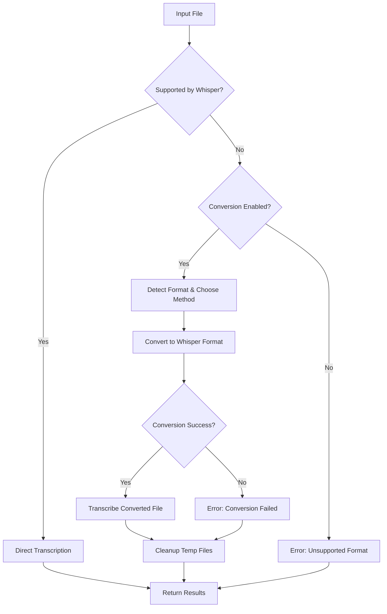

# Audio Conversion Workflow for Whisper MCP Server

## Overview

The Whisper MCP Server now includes comprehensive audio conversion capabilities that automatically handle various audio and video file formats. This allows users to transcribe files that aren't natively supported by Whisper without manual conversion.

## Features

### 🔄 Automatic Conversion
- **Seamless Integration**: Files are automatically converted before transcription
- **Format Detection**: Smart detection of file formats and conversion needs
- **Multiple Methods**: Supports both ffmpeg and librosa conversion backends
- **Temporary File Management**: Automatic cleanup of temporary conversion files

### 📁 Supported Input Formats

**Video Formats (Audio Extraction):**
- MP4, MOV, AVI, MKV, WMV, FLV, WebM, 3GP, M4V

**Audio Formats:**
- AAC, AC3, AIFF, AMR, APE, AU, DTS, MKA, MPC, RA, WMA
- Opus, Speex, TTA, VOC, WavPack, XA, CAF, DSS, DVF
- GSM, IFF, M4R, MMF, MXF, NIST, PVF, RAW, SLN, VMS, VOX, W64

**Whisper Native Formats (No Conversion Needed):**
- MP3, WAV, M4A, FLAC, OGG, WebM

## Configuration

### Enable/Disable Conversion
```python
# In config/server_config.yaml
conversion:
  enable_conversion: true  # Set to false to disable
  quality: "high"         # high, medium, low
  temp_dir: null          # Use system temp if null
  cleanup_temp_files: true
```

### Quality Settings
- **High**: Best quality, larger files, slower conversion
- **Medium**: Balanced quality and speed (default)
- **Low**: Faster conversion, smaller files, lower quality

## Usage

### 1. Automatic Conversion (Transparent)
When you use any existing transcription tool, conversion happens automatically:

```json
{
  "tool": "whisper-transcribe",
  "arguments": {
    "audio_file": "path/to/video.mp4"  // Will be converted to WAV automatically
  }
}
```

### 2. Manual Conversion Tool
For explicit control over conversion:

```json
{
  "tool": "whisper-convert-audio",
  "arguments": {
    "input_file": "path/to/video.mov",
    "output_format": "wav",
    "quality": "high",
    "output_file": "path/to/output.wav"  // Optional
  }
}
```

#### Parameters:
- `input_file` (required): Path to input audio/video file
- `output_format` (optional): Target format (wav, mp3, m4a, flac, ogg)
- `quality` (optional): Conversion quality (high, medium, low)
- `output_file` (optional): Output path (auto-generated if not provided)

## Technical Details

### Conversion Methods

1. **FFmpeg (Preferred)**
   - Handles all audio and video formats
   - Best compatibility and quality
   - Automatic detection and installation verification

2. **Librosa (Fallback)**
   - Audio-only files
   - Python-based processing
   - Good for basic audio format conversion

### File Processing Workflow



### Temporary File Management
- Converted files are stored in temporary directories
- Automatic cleanup after transcription
- Configurable temp directory location
- Graceful handling of cleanup failures

## Dependencies

### Required
- `ffmpeg`: For video/audio conversion (recommended)
- `librosa`: For audio-only conversion (fallback)
- `soundfile`: For audio I/O operations

### Installation
```bash
# Install Python dependencies
pip install ffmpeg-python librosa soundfile

# Install FFmpeg (system-level)
# Windows: Download from https://ffmpeg.org/download.html
# macOS: brew install ffmpeg
# Linux: apt-get install ffmpeg (or equivalent)
```

## Error Handling

### Common Issues

**1. FFmpeg Not Found**
```
Error: FFmpeg not found in common locations
Solution: Install FFmpeg or add to PATH
```

**2. Conversion Failed**
```
Error: All conversion methods failed
Solution: Check file integrity, format support, or disk space
```

**3. Unsupported Format**
```
Error: Unsupported format. Supported: ...
Solution: Check if format is in supported list or file is corrupted
```

### Troubleshooting

1. **Check FFmpeg Installation**
   ```bash
   ffmpeg -version  # Should show version info
   ```

2. **Test Conversion Manually**
   ```bash
   python test_conversion.py
   ```

3. **Enable Debug Logging**
   ```python
   import logging
   logging.getLogger('audio_converter').setLevel(logging.DEBUG)
   ```

## Performance Considerations

### Conversion Speed
- **Video files**: 2-5x real-time (depends on duration and quality)
- **Audio files**: 10-50x real-time (format dependent)
- **Network files**: Download time + conversion time

### Memory Usage
- **Large files**: Temporary disk space = ~2x original file size
- **Concurrent conversions**: Limited by `max_concurrent_transcriptions`

### Optimization Tips
1. Use `medium` quality for faster processing
2. Set appropriate temporary directory with sufficient space
3. Enable cleanup to prevent disk space issues
4. Consider pre-converting frequently used files

## Examples

### Converting Video Files
```python
# Automatic conversion during transcription
from whisper_runner import WhisperRunner
from models import TranscriptionConfig

config = TranscriptionConfig(
    audio_file="presentation.mp4",  # Will be converted to WAV
    language="en"
)
result = await runner.transcribe_audio(config)
```

### Manual Conversion
```python
# Explicit conversion
from audio_converter import AudioConverter, ConversionConfig

converter = AudioConverter()
config = ConversionConfig(
    input_file="interview.mov",
    output_format="mp3",
    quality="high"
)
result = await converter.convert_file(config)
```

### Batch Processing with Conversion
```python
# Batch transcription with mixed formats
from models import BatchTranscriptionConfig

config = BatchTranscriptionConfig(
    audio_files=[
        "file1.mp4",  # Will be converted
        "file2.wav",  # Direct transcription
        "file3.mov",  # Will be converted
    ]
)
result = await runner.batch_transcribe(config)
```

## Version Compatibility

- **Minimum Python**: 3.8+
- **FFmpeg**: 4.0+ (recommended: latest stable)
- **Librosa**: 0.10.0+
- **Transformers**: 4.35.0+

## Contributing

To extend format support:

1. Add format to `CONVERTIBLE_FORMATS` in `AudioConverter`
2. Update format detection in `_detect_audio_format()`
3. Test with `test_conversion.py`
4. Update documentation

## Changelog

### v1.1.0 - Audio Conversion Support
- ✨ Added comprehensive audio/video conversion
- ✨ Automatic format detection and conversion
- ✨ Manual conversion MCP tool
- ✨ Temporary file management
- ✨ Multiple conversion backends (ffmpeg, librosa)
- 🛡️ Robust error handling and cleanup
- 📚 Comprehensive testing and documentation